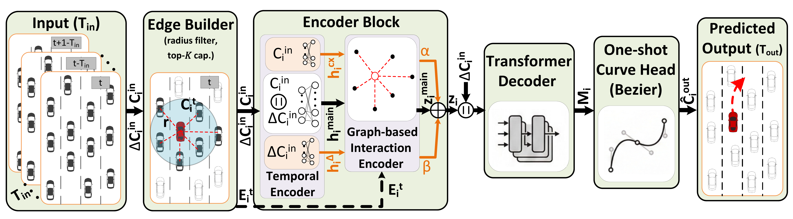

# EdgeVTP

**EdgeVTP** (Efficient Edge Vehicle Trajectory Prediction) is a lightweight, graph-based trajectory prediction codebase designed for high-performance highway surveillance. It features one-shot Bezier decoding and TCN-based residual modules for optimal accuracy-latency trade-offs on edge devices.



---

- [🚀 Quick Start](#-quick-start)
- [📊 Paper Results](#-paper-results)
- [📂 Repository Structure](#-repository-structure)
- [📜 Citation](#-citation)

---

## 🚀 Quick Start

### 1. Installation
```bash
conda create -n edgevtp python=3.8 -y
conda activate edgevtp

# Install PyTorch & PyG
pip install torch==1.12.0+cu116 torchvision==0.13.0+cu116 --extra-index-url https://download.pytorch.org/whl/cu116
pip install torch-scatter torch-sparse torch-cluster torch-spline-conv -f https://data.pyg.org/whl/torch-1.12.0+cu116.html
pip install torch-geometric==2.0.4 -r requirements.txt
```

### 2. Dataset Setup
Place preprocessed datasets in the following structure:
```text
datasets/
  ngsim/
    train/
    val/
    test/
  Carolinas_eyelevel/
    train/
    val/
    test/
  Carolinas_highAngle/
    train/
    val/
    test/
```

### 3. Download Datasets
*   **NGSIM**: [Download here](https://drive.google.com/file/d/16xKlIgvZQrpi0Wm6sPpKyhGjQRPIwFW0/view)
*   **Carolinas (Eye-level & High-Angle)**: Both splits are in one zip — [Carolinas_datasets.zip](https://drive.google.com/file/d/1CEuQL04AZHFpog8FC54SsKSPWsRCvr3h/view?usp=drive_link). Extract so you have `datasets/Carolinas_eyelevel/` and `datasets/Carolinas_highAngle/` as in the structure above.

### 4. Running Inference (Paper Repro)
Pre-trained weights are **included** in the `experiments/vehicle/train/` folders. You can reproduce the paper's key operating points immediately:

#### NGSIM
| Model | Radius | Residual | Config Path |
| :--- | :--- | :--- | :--- |
| **Latency** | 20m | No | `experiments/vehicle/inference/inference_ngsim_20m_oneshot_bezier_80ep_k16_5hz/config.yaml` |
| **Balanced** | 20m | Yes | `experiments/vehicle/inference/inference_ngsim_20m_oneshot_bezier_80ep_residual_v2_tcn_5hz_k16/config.yaml` |
| **Error** | 30m | Yes | `experiments/vehicle/inference/inference_ngsim_30m_oneshot_bezier_80ep_residual_v2_tcn_5hz_k16/config.yaml` |

#### Carolinas (CHD)
| Dataset | Radius | Residual | Config Path |
| :--- | :--- | :--- | :--- |
| **Eye-level** | 20m | Yes | `experiments/vehicle/inference/inference_carolinas_eyelevel_20m_oneshot_bezier_80ep_residual_v2_tcn_5hz_k16/config.yaml` |
| **High-Angle** | 20m | Yes | `experiments/vehicle/inference/inference_carolinas_highAngle_20m_oneshot_bezier_80ep_residual_v2_tcn_5hz_k16/config.yaml` |

**Command:**
```bash
python main.py --config <CONFIG_PATH>
```

---

## 📊 Paper Results

### 1. NGSIM: Accuracy-Latency Trade-off
EdgeVTP achieves competitive prediction quality while being significantly faster than transformer-based baselines.

| Model | ADE ↓ | FDE ↓ | E2E Latency ↓ | Improvement |
| :--- | :---: | :---: | :---: | :--- |
| Pishgu | 2.44 | 5.39 | 3.50 ms | - |
| CS-LSTM | 2.29 | 3.34 | 3.61 ms | - |
| STA-LSTM | **1.89** | **3.16** | 5.01 ms | - |
| VT-Former-SH | 2.10 | 4.91 | 23.69 ms | - |
| **EdgeVTP-Lat (Ours)** | 2.13 | 4.93 | **3.17 ms** | **7.4x faster** than VT-Former |
| **EdgeVTP-Balanced (Ours)** | **1.89** | 4.37 | 4.30 ms | Balanced performance |
| **EdgeVTP-Error (Ours)** | **1.85** | 4.25 | 4.58 ms | **Best Accuracy** |

*Note: E2E latency measured on NVIDIA H100 (batch=1) using a unified protocol.*

### 2. Carolinas (CHD): Robustness Across Viewpoints
EdgeVTP outperforms state-of-the-art methods across different surveillance perspectives.

#### Eye-level Split (Pixels ↓)
| Model | ADE | FDE |
| :--- | :---: | :---: |
| S-STGCNN | 24.33 | 95.22 |
| VT-Former-SH | 21.86 | 66.28 |
| **EdgeVTP-Balanced (Ours)** | **19.24** | **56.55** |

#### High-Angle Split (Pixels ↓)
| Model | ADE | FDE |
| :--- | :---: | :---: |
| Pishgu | 18.33 | 61.92 |
| VT-Former-SH | 25.33 | 88.99 |
| **EdgeVTP-Error (Ours)** | **15.23** | **52.28** |

### 3. Edge Device Benchmarks (Jetson)
EdgeVTP is designed for real-world deployment on resource-constrained hardware.

| Model | Jetson Nano (10W) ↓ | Jetson Xavier NX (20W) ↓ |
| :--- | :---: | :---: |
| VT-Former-LH | 1034.26 ms | 400.95 ms |
| STA-LSTM | 51.82 ms | 30.64 ms |
| **EdgeVTP-Lat (Ours)** | **27.87 ms** (~37x faster) | **11.85 ms** (~34x faster) |

---

## 📂 Repository Structure

*   `configs/`: Core YAML recipes for NGSIM and archive sweeps.
*   `experiments/`: Checkpoints (`ngsim.pt`) and result logs for paper runs.
*   `scripts/`: Automation for benchmarks and pruning.
*   `utils/`: Shared model components and utilities.

---

## 📜 Citation

If you find this work useful, please cite our CVPR EVW 2026 paper:

```bibtex
@inproceedings{edgevtp2026,
  title={EdgeVTP: Efficient Edge Vehicle Trajectory Prediction via Graph-based Transformer},
  author={Kim, Seungjin and Jafarpourmarzouni, Reza and Neff, Christopher and Tabkhivayghan, Hamed and Katariya, Vinit},
  booktitle={Proceedings of the IEEE/CVF Conference on Computer Vision and Pattern Recognition Workshops (CVPRW)},
  year={2026}
}
```

---
**License**: See `LICENSE`.
